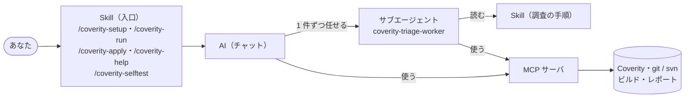

# Coverity トリアージエージェント

Coverity の警告を AI が調査し、警告ごとに **「修正案」と「逸脱コメント案」** を作ります。
あなたは一覧を見て、承認するだけです。

## はじめに（初回だけ・約 15 分）

1. **プラグインを入れる**：このリポジトリを VS Code または Copilot CLI にプラグインのマーケットプレイスとして登録し、`coverity-triage` をインストールします。
2. **対象リポジトリを VS Code で開き、Copilot Chat で次を入力します。**

   ```
   /coverity-setup
   ```

   AI が、必要なものの準備から設定まで対話で案内します。あなたが答えるのは **Coverity の URL・プロジェクト名・ストリーム名** だけです。
   （git / svn / Coverity はすでに使える前提です）

## 毎回の使い方（3 ステップ）

| | やること | 何が起きるか |
|---|---|---|
| 1 | `/coverity-run` | AI が警告を調査し、一覧 `summary.md` を作ります（1 件数分） |
| 2 | `summary.md` の **「承認」列** を確認 | 推奨案が下書き済みです。変えたい行だけ `修正` / `逸脱` / `却下` に書き換えます |
| 3 | `/coverity-apply` | 件数を確認して「はい」。**修正**はプルリクエスト作成（svn はワーキングコピーに適用。コミットはご自身で）、**逸脱**は Coverity に登録されます。最後に、あなたが推奨を変えた・直した点から「次回に活かす知識」を提案するので、選んだものだけ `.coverity-triage/knowledge.md` に追記されます（コミットしてチームで共有） |

一覧は確信度の低い順に並んでいます。確信度「高」は 1 行の見立てに納得できれば、そのまま承認して構いません。
出力の実物：[docs/sample-output/summary.md](docs/sample-output/summary.md)

## 困ったら

`/coverity-help` に日本語で聞いてください。例：

- `/coverity-help このエラーは何？`
- `/coverity-help MISRA の警告だけ調べたい`
- `/coverity-help どれくらい役立っている？`

この PC でプラグインが正しく動くかは `/coverity-selftest` で確かめられます。結果は `report.md` にまとまるので、うまく動かないときはその結果フォルダをプラグインの管理者に共有してください。手順（クローンから）：[テスト手順書](docs/selftest.md)

## このプラグインの仕組み

あなたが使うのは **5 つの Skill（`/coverity-setup` など）だけ** です。VS Code ではプラグイン名が付き、`/coverity-triage:coverity-setup` のように表示されます。
Skill の手順に沿って AI が MCP サーバのツールで作業し、警告 1 件ずつの調査は専用のサブエージェントに任せます。



| 種類 | 名前 | できること |
|---|---|---|
| Skill（入口。あなたが呼ぶ） | `/coverity-setup` | 初回の準備（Python 環境・設定ファイル・認証情報・試しのビルド）を AI が案内 |
| | `/coverity-run` | 警告を取得し、1 件ずつサブエージェントに調べさせ、一覧 `summary.md` を作る |
| | `/coverity-apply` | 承認した内容だけを反映（修正ブランチ／パッチ、Coverity への書き戻し）し、次回に活かす知識の追記を提案 |
| | `/coverity-help` | 使い方・エラー・設定変更・知識の追加・効果の集計に答える |
| | `/coverity-selftest` | この PC・社内 Coverity・社内のビルドでプラグインが動くかを実際に動かして確かめ、結果を `report.md` にまとめる |
| サブエージェント | `coverity-triage-worker` | 警告 1 件（またはまとめた 1 グループ）を調べ、修正案と逸脱コメント案を書く（使えるツールを調査用に限定） |
| Skill（調査の手順。AI が読む） | `triage-investigation` | 警告が本物かを調べる手順、確信度の基準、推奨の選び方、プロジェクトの知識の使い方 |
| | `checker-knowledge` | チェッカーごとの着眼点（標準・MISRA・CERT） |
| | `code-fix` | 修正案を作るときの制約と手順 |
| | `deviation-comment` | 逸脱コメントの書き方、Classification / Action / Severity の選び方 |
| | `triage-report` | レポートの書式と記載基準 |
| MCP サーバ | `coverity-triage`（ツール 28 個） | Coverity との通信、git / svn の操作、文字コードを保った編集、ビルド・再解析、レポート作成 |

## 安心して使うために

- 承認して反映するまで、あなたのコードも Coverity も **変更されません**。
- パスワードやトークンを **チャットに入力することはありません**（伏せ字の入力欄に入力します）。

---

<details>
<summary>開発者向け</summary>

| 資料・フォルダ | 内容 |
|---|---|
| [docs/spec.md](docs/spec.md) | 要件仕様 |
| [docs/design.md](docs/design.md) | 構成設計と実装の状況 |
| [docs/selftest.md](docs/selftest.md) | テスト手順書（クローンから `/coverity-selftest` の実行・結果の共有まで） |
| `plugins/coverity-triage/` | プラグイン本体（Skill、サブエージェント、MCP サーバ） |
| `.github/plugin/marketplace.json` | マーケットプレイスの定義（プラグインを更新するときは `plugin.json` と `version` をそろえる） |

```bash
cd plugins/coverity-triage/server
uv run pytest -q
```

</details>
