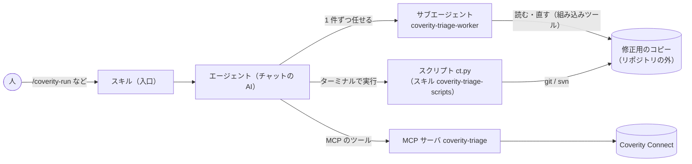

# 開発する人へ

## 資料

| 資料 | 内容 |
|---|---|
| [spec.md](spec.md) | 何を作るか（目的、使い方、成功の基準、機能、決定の記録） |
| [design.md](design.md) | どう作るか（部品の役割、処理の流れ、ファイルの形、根拠にした公式仕様） |
| [selftest.md](selftest.md) | 社内の環境での動作確認の手順 |
| [sample-output/](sample-output/README.md) | 一覧と詳細レポートの見本 |

## 仕組み（あらまし）

公式の役割分担に合わせて部品を分けています（詳しくは [design.md](design.md) の 1 章）。



| 部品 | 場所 | 役割 |
|---|---|---|
| スキル（入口） | `plugins/coverity-triage/skills/coverity-*/` | 人が `/` で呼ぶ手順 |
| スクリプト | `skills/coverity-triage-scripts/scripts/ct.py`、`ctlib/` | 決まった処理（実行フォルダ、グループ化、修正用のコピー、差分とブランチ、レポート、反映、動作確認） |
| MCP サーバ | `plugins/coverity-triage/server/` | Coverity との通信だけ（接続の確認、検索、警告経路、書き戻し） |
| サブエージェント | `com.github.copilot/agents/coverity-triage-worker.agent.md` | 警告 1 件を調べて 2 つの案を書く。使えるのは読み取り・検索・編集・スキルだけ |
| スキル（知識） | `skills/triage-investigation/` など 5 つ | サブエージェントが読む調べ方・書き方 |

## テスト

リポジトリの一番上で実行します（uv が要ります。svn のテストは svn が無ければ飛ばします）。

```
uv run pytest
```

| テスト | 確かめること |
|---|---|
| `tests/server/` | MCP サーバ（偽の Coverity の応答、時間で区切って続きを返すこと、`mcp.json` と同じ起動方法でつながること） |
| `tests/scripts/` | スクリプト（実行から反映までの流れを git と svn で、準備、オプション、動作確認のコマンド） |
| `tests/test_plugin_files.py` | プラグインのファイルの形（スキルとサブエージェントの frontmatter、`mcp.json`）、スキルに書いたコマンドとツールが実在すること |

テストは偽の Coverity と見本のリポジトリで動かします。サブエージェントの役はテストが代わりに行う（決まった修正と結果ファイルを書く）ので、AI の判断の質はテストしません。AI の判断や、Copilot の上での動き（ツールの許可、サブエージェントの起動、スキルの読み込み）は、`/coverity-selftest` と [selftest.md](selftest.md) の手順で確かめます。

## 見本の作り直し

レポートや一覧の形を変えたら、見本を作り直します。

```
uv run python tests/tools/make_sample_output.py
```

## 版数

プラグインを変えたら、`plugins/coverity-triage/plugin.json` と `.github/plugin/marketplace.json` の `version` をそろえて上げます（`tests/test_plugin_files.py` が確かめます）。
MCP サーバの依存ライブラリを変えたら、`plugins/coverity-triage/server` で `uv lock` を実行して `uv.lock` を更新します（MCP サーバは `uv run --frozen` で起動するため）。
